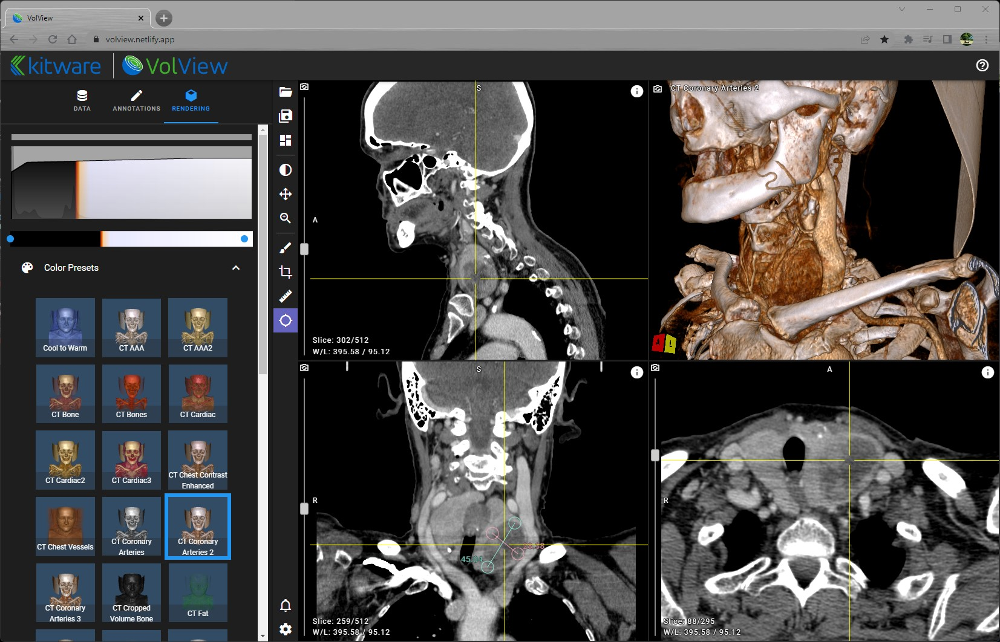

# Vue.js UI Framework with itk-wasm to create a Web App

## VolView

[VolView](https://volview.kitware.com) is an open source radiological viewer developed for clinical professionals. With VolView, you can have a deeper visual understanding of your data through interactive, cinematic volume rendering and easily visualize your DICOM data in 3D. Since VolView runs in your browser, you don’t need to install software and your data stays securely on your machine.

VolView uses itk-wasm to provide segmentation, registration, input/output, and analysis algorithms that can be applied to data loaded with the app. All processing occurs within your browser, and no software needs to be downloaded or installed on your machine.

### Live VolView Application

  <iframe
    allow="geolocation; microphone; camera; midi; encrypted-media"
    src="https://volview.netlify.app/"
    alt="VolView Application"
    style="height: 100%; width: 100%; border: 0;">
  </iframe>

