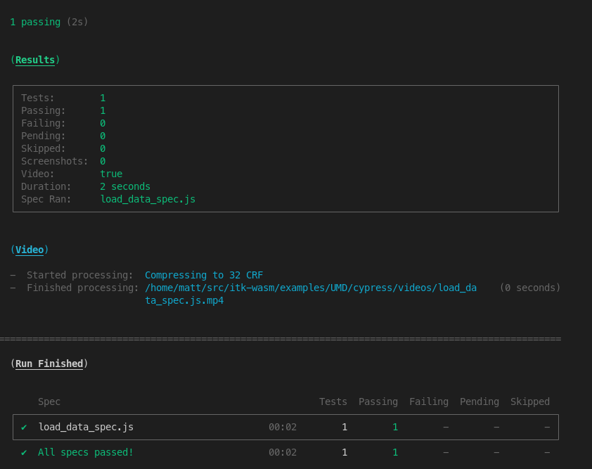

# itk-wasm in a browser application via Webpack

This example demonstrates how to use *itk-wasm* in a web browser application built with [Webpack](https://webpack.js.org/). Find the full example in the `itk-wasm/examples/Webpack` [directory of the GitHub repository](https://github.com/InsightSoftwareConsortium/itk-wasm/tree/main/examples/Webpack).

Since we asynchronously download the *itk-wasm* JavaScript and WebAssembly Emscripten modules, a few extra configuration steps are required.

This example assumes you are creating a [Node.js package](https://docs.npmjs.com/getting-started/what-is-npm). If you do not already have a `package.json` file, [create one](https://docs.npmjs.com/getting-started/using-a-package.json), first.

Add `itk-wasm` and the io-packages to your project's dependencies:

```sh
npm install --save itk-wasm itk-image-io itk-mesh-io
```

Then, install Webpack-related development dependencies:

```sh
npm install --save-dev webpack webpack-cli webpack-dev-server worker-loader babel-loader '@babel/preset-env' '@babel/core' copy-webpack-plugin
```

Next, create a `webpack.config.js` file like the following:

```js
const path = require('path')

const webpack = require('webpack')
const CopyPlugin = require('copy-webpack-plugin')

const entry = path.join(__dirname, 'src', 'index.js')
const outputPath = path.join(__dirname, './dist')
const itkConfig = path.resolve(__dirname, 'src', 'itkConfig.js')

module.exports = {
  entry,
  output: {
    path: outputPath,
    filename: 'index.js',
    library: {
      type: 'umd',
      name: 'bundle',
    },
  },
  module: {
    rules: [
      { test: /\.js$/, loader: 'babel-loader' }
    ]
  },
  plugins: [
    new CopyPlugin({
      patterns: [
        {
          from: path.join(__dirname, 'node_modules', 'itk-wasm', 'dist', 'web-workers'),
          to: path.join(__dirname, 'dist', 'itk', 'web-workers')
        },
        {
          from: path.join(__dirname, 'node_modules', 'itk-image-io'),
          to: path.join(__dirname, 'dist', 'itk', 'image-io')
        },
        {
          from: path.join(__dirname, 'node_modules', 'itk-mesh-io'),
          to: path.join(__dirname, 'dist', 'itk', 'mesh-io')
        }
    ]})
  ],
  resolve: {
    fallback: { fs: false, path: false, url: false, module: false },
    alias: {
      '../itkConfig.js': itkConfig,
      '../../itkConfig.js': itkConfig,
    },
  },
  performance: {
    maxAssetSize: 10000000
  }
}
```

Replace `src/index.js` by your [Webpack entry point](https://webpack.js.org/concepts/#entry). Replace `./dist/` and the output filename with where you [want Webpack to place the generated JavaScript bundle](https://webpack.js.org/concepts/#output).


The [babel-loader](https://github.com/babel/babel-loader) rule will [transpile](https://scotch.io/tutorials/javascript-transpilers-what-they-are-why-we-need-them) JavaScript from the latest language syntax to a syntax supported by existing browser clients. Configure the target browsers to support with a `.babelrc` file like the following:

```js
{
  presets: [
    ['@babel/preset-env', {
      targets: {
        browsers: ['last 2 versions'],
      },
    }],
  ],
}
```

The *itk-wasm* Emscripten modules are loaded and executed **asynchronously** and **on demand**. This means the client only download the content it needs and the user does not experience interruption of the main user interface thread during computation. However, a few extra configuration steps are required since the modules are not bundled by Webpack.

The `CopyPlugin` copies *itk-wasm* Emscripten modules to distribute along with your Webpack bundle. In this example, we copy all *image-io*, and *mesh-io*. In your project, you may want to copy only the *image-io* or a subset of the *image-io*, based on your needs. We also copy the *web-workers*, which asynchronously perform IO or run processing pipelines in a background thread.

To change the location of the *itk-wasm* web worker and Emscripten modules, set the Webpack `resolve.alias` setting for an `itkConfig.js` module so the bundle will use our included web worker and io WebAssembly modules. The `src/itkConfig.js` for this example is:

```js
const itkConfig = {
  pipelineWorkerUrl: '/itk/web-workers/min-bundles/pipeline.worker.js',
  imageIOUrl: '/itk/image-io',
  meshIOUrl: '/itk/mesh-io',
  pipelinesUrl: '/itk/pipelines',
}

export default itkConfig
```

Define commands to build the project or build the project and start a local development web server in the *scripts* section of the `package.json` file,

```js
  "scripts": {
    "build": "webpack --progress --colors -p",
    "start": "webpack-dev-server --content-base ./dist/ --watch-content-base"
  },
```

Build the project with

```sh
npm run build
```

To start the development web server, run

```sh
npm run start
```

## Testing with Cypress

This section described how to configure browser-based testing with the [Cypress](https://www.cypress.io/)

First, install Cypress and the `start-server-and-test` package.

```sh
npm install --save-dev cypress start-server-and-test
```

The `start-server-and-test` tool can start our development server for testing with Cypress.

Create directories to house our tests and test data:

```sh
mkdir -p cypress/integration cypress/fixtures
```

Provide a test dataset:

```sh
cp /path/to/cow.vtk cypress/fixtures/cow.vtk
```

Create our test script at *cypress/integration/load_data_spec.js*. The test files names should end in **_spec.js*.

```js
describe('Load data', () => {
  it('successfully loads a mesh', () => {
    cy.visit('http://localhost:8080/')
    cy.fixture('cow.vtk', null).then((cowBuffer) => {
      cy.get('input[type=file]').selectFile({ contents: cowBuffer, fileName: 'cow.vtk' })
      cy.get('textarea').contains('"numberOfPoints": 2903,')
    })
  })
})
```

Then, specify npm scripts to develop and debug the tests and run them in an automated way.

```js
  "scripts": {
    "start": "webpack-dev-server --mode development --static ./dist/",
    "cypress:open": "npx cypress open",
    "cypress:run": "npx cypress run",
    "test:debug": "start-server-and-test start http-get://localhost:8080 cypress:open",
    "test": "start-server-and-test start http-get://localhost:8080 cypress:run"
  },
```

Note that [with webpack-dev-server](https://github.com/bahmutov/start-server-and-test#note-for-webpack-dev-server-users) we need to use `http-get` with `start-server-and-test`.

To develop or debug tests, run

```sh
npm run test:debug
```

This will open Cypress. Select the test to run:


This will load the selected browser to see the test status and web page that is tested.  You can also open the browser's development console.


To run the tests during continuous integration:

```sh
npm run test
```

This will output the tests results in the console:



And produce a video of the result at *cypress/videos/*.


