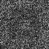
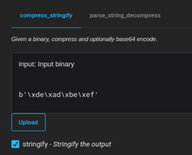
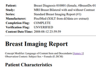
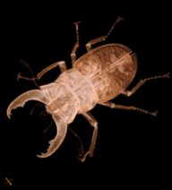
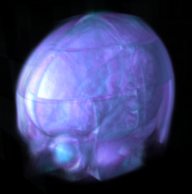
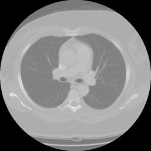
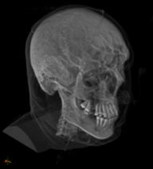
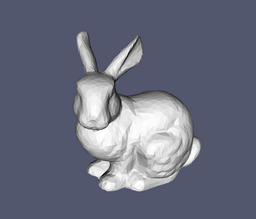
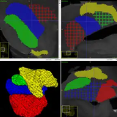

# Packages

Example packages built with itk-wasm can be found below. If you created a
package, please [open a pull
request](https://github.com/InsightSoftwareConsortium/ITK-Wasm/compare) to add it to the table!

```{list-table} Example packages
:header-rows: 1
:label: example-packages
:class: text-center

* - Description
  - Links 
* - [][compare-images-demo-js] [compare-images][compare-images-repo] <br /> *Compare images with a tolerance for regression testing.* 
  - ![js][js-logo] [👨‍💻 Demo][compare-images-demo-js] <br />[🕮 Docs][compare-images-docs-js] <br />[📦 Package][compare-images-package-js] <br /><br /> ![py][py-logo] [🕮 Docs][compare-images-docs-py] <br />[📦 Package][compare-images-package-py]  
* - [][compress-stringify-demo-js] [compress-stringify][compress-stringify-repo] <br /> *Zstandard compression and decompression and base64 encoding and decoding in WebAssembly.*
  - ![js][js-logo] [👨‍💻 Demo][compress-stringify-demo-js] <br />[🕮 Docs][compress-stringify-docs-js] <br />[📦 Package][compress-stringify-package-js] <br/> <br/> ![py][py-logo] [👨‍💻 Demo][compress-stringify-demo-py] <br />[🕮 Docs][compress-stringify-docs-py] <br />[📦 Package][compress-stringify-package-py]
* - [][dicom-demo-js] [dicom][dicom-repo] <br /> *Read files and images related to DICOM file format.*
  - ![js][js-logo] [👨‍💻 Demo][dicom-demo-js] <br/>[🕮 Docs][dicom-docs-js] <br/>[📦 Package][dicom-package-js] <br /><br/> ![py][py-logo] [🕮 Docs][dicom-docs-py] <br/>[📦 Package][dicom-package-py]
* - [][downsample-demo-js] [downsample][downsample-repo] <br /> *Pipelines for downsampling images.*
  - ![js][js-logo] [👨‍💻 Demo][downsample-demo-js] <br/>[🕮 Docs][downsample-docs-js] <br/>[📦 Package][downsample-package-js] <br/> <br/> ![py][py-logo] [🕮 Docs][downsample-docs-py] <br/>[📦 Package][downsample-package-py]
* - [][elastix-demo-js] [elastix][elastix-repo] <br /> *A toolbox for rigid and nonrigid registration of images.*
  - ![js][js-logo] [👨‍💻 Demo][elastix-demo-js] <br/>[🕮 Docs][elastix-docs-js] <br/>[📦 Package][elastix-package-js] <br/> <br/> ![py][py-logo] [🕮 Docs][elastix-docs-py] <br/>[📦 Package][elastix-package-py]
* - [][htj2k-demo-js] [htj2k][htj2k-repo] <br /> *Wasm-SIMD accelerated decoding and encoding High-throughput JPEG2000 (HTJ2K) images.*
  - ![js][js-logo] [👨‍💻 Demo][htj2k-demo-js] <br/>[🕮 Docs][htj2k-docs-js] <br/>[📦 Package][htj2k-package-js] <br/> <br/> ![py][py-logo] [🕮 Docs][htj2k-docs-py] <br/>[📦 Package][htj2k-package-py]
* - [][image-io-demo-js] [image-io][image-io-repo] <br /> *Input and output for scientific and medical image file formats.*
  - ![js][js-logo] [👨‍💻 Demo][image-io-demo-js] <br/>[🕮 Docs][image-io-docs-js] <br/>[📦 Package][image-io-package-js] <br/> <br/> ![py][py-logo] [🕮 Docs][image-io-docs-py] <br/>[📦 Package][image-io-package-py]
* - [][mesh-io-demo-js] [mesh-io][mesh-io-repo]<br /> *Input and output for scientific and medical mesh file formats.*
  - ![js][js-logo] [👨‍💻 Demo][mesh-io-demo-js] <br/>[🕮 Docs][mesh-io-docs-js] <br/>[📦 Package][mesh-io-package-js] <br/> <br/> ![py][py-logo] [🕮 Docs][mesh-io-docs-py] <br/>[📦 Package][mesh-io-package-py]
* - [][morphological-contour-interpolation-demo-js] [morphological-contour-interpolation][morphological-contour-interpolation-repo] <br /> *Input and output for scientific and medical mesh file formats.*
  -  ![js][js-logo] [👨‍💻 Demo][morphological-contour-interpolation-demo-js] <br/>[🕮 Docs][morphological-contour-interpolation-docs-js] <br/>[📦 Package][morphological-contour-interpolation-package-js] <br/> <br/> ![py][py-logo] [🕮 Docs][morphological-contour-interpolation-docs-py] <br/>[📦 Package][morphological-contour-interpolation-package-py]

```

[js-logo]: ../static/javascript-logo.svg
[ts-logo]: ../static/typescript-logo.svg
[py-logo]: ../static/python.svg
[gh-logo]: ../static/github.svg

[compare-images-repo]: https://github.com/InsightSoftwareConsortium/ITK-Wasm/tree/main/packages/compare-images
[compare-images-demo-js]: https://insightsoftwareconsortium.github.io/ITK-Wasm/compare-images/ts/app/
[compare-images-docs-js]: https://insightsoftwareconsortium.github.io/ITK-Wasm/compare-images/ts/docs/
[compare-images-package-js]: https://www.npmjs.com/package/@itk-wasm/compare-images
[compare-images-docs-py]: https://insightsoftwareconsortium.github.io/ITK-Wasm/compare-images/py/docs/
[compare-images-package-py]: https://pypi.org/project/itkwasm-compare-images/

[compress-stringify-repo]: https://github.com/InsightSoftwareConsortium/ITK-Wasm/tree/main/packages/compress-stringify
[compress-stringify-demo-js]: https://insightsoftwareconsortium.github.io/ITK-Wasm/compress-stringify/ts/app/
[compress-stringify-docs-js]: https://insightsoftwareconsortium.github.io/ITK-Wasm/compress-stringify/ts/docs/
[compress-stringify-package-js]: https://www.npmjs.com/package/@itk-wasm/compress-stringify
[compress-stringify-demo-py]: https://itk-compress-stringify-py-app.on.fleek.co/
[compress-stringify-docs-py]: https://insightsoftwareconsortium.github.io/ITK-Wasm/compress-stringify/py/docs/
[compress-stringify-package-py]: https://pypi.org/project/itkwasm-compress-stringify/

[elastix-repo]: https://github.com/InsightSoftwareConsortium/ITKElastix
[elastix-demo-js]: https://js.app.elastix.wasm.itk.eth.limo/
[elastix-docs-js]: https://js.docs.elastix.wasm.itk.eth.limo/
[elastix-package-js]: https://www.npmjs.com/package/@itk-wasm/elastix
[elastix-docs-py]: https://py.docs.elastix.wasm.itk.eth.limo/
[elastix-package-py]: https://pypi.org/project/itkwasm-elastix/

[dicom-repo]: https://github.com/InsightSoftwareConsortium/ITK-Wasm/tree/main/packages/dicom
[dicom-demo-js]: https://insightsoftwareconsortium.github.io/ITK-Wasm/dicom/ts/app/
[dicom-docs-js]: https://insightsoftwareconsortium.github.io/ITK-Wasm/dicom/ts/docs/
[dicom-package-js]: https://www.npmjs.com/package/@itk-wasm/dicom
[dicom-docs-py]: https://insightsoftwareconsortium.github.io/ITK-Wasm/dicom/py/docs/
[dicom-package-py]: https://pypi.org/project/itkwasm-dicom/

[htj2k-repo]: https://github.com/InsightSoftwareConsortium/ITKIOOpenJPH/tree/main/src/wasm
[htj2k-demo-js]: https://js.app.htj2k.wasm.itk.eth.limo/
[htj2k-docs-js]: https://js.docs.htj2k.wasm.itk.eth.limo/
[htj2k-package-js]: https://www.npmjs.com/package/@itk-wasm/htj2k
[htj2k-docs-py]: https://py.docs.htj2k.wasm.itk.eth.limo/
[htj2k-package-py]: https://pypi.org/project/itkwasm-htj2k/

[downsample-repo]: https://github.com/InsightSoftwareConsortium/ITK-Wasm/tree/main/packages/downsample
[downsample-demo-js]: https://insightsoftwareconsortium.github.io/ITK-Wasm/downsample/ts/app/
[downsample-docs-js]: https://insightsoftwareconsortium.github.io/ITK-Wasm/downsample/ts/docs/
[downsample-package-js]: https://www.npmjs.com/package/@itk-wasm/downsample
[downsample-docs-py]: https://insightsoftwareconsortium.github.io/ITK-Wasm/downsample/py/docs/
[downsample-package-py]: https://pypi.org/project/itkwasm-downsample/

[image-io-repo]: https://github.com/InsightSoftwareConsortium/ITK-Wasm/tree/main/packages/image-io
[image-io-demo-js]: https://insightsoftwareconsortium.github.io/ITK-Wasm/image-io/ts/app/
[image-io-docs-js]: https://insightsoftwareconsortium.github.io/ITK-Wasm/image-io/ts/docs/
[image-io-package-js]: https://www.npmjs.com/package/@itk-wasm/image-io
[image-io-docs-py]: https://insightsoftwareconsortium.github.io/ITK-Wasm/image-io/py/docs/
[image-io-package-py]: https://pypi.org/project/itkwasm-image-io/

[mesh-io-repo]: https://github.com/InsightSoftwareConsortium/ITK-Wasm/tree/main/packages/mesh-io
[mesh-io-demo-js]: https://insightsoftwareconsortium.github.io/ITK-Wasm/mesh-io/ts/app/
[mesh-io-docs-js]: https://insightsoftwareconsortium.github.io/ITK-Wasm/mesh-io/ts/docs/
[mesh-io-package-js]: https://www.npmjs.com/package/@itk-wasm/mesh-io
[mesh-io-docs-py]: https://insightsoftwareconsortium.github.io/ITK-Wasm/mesh-io/py/docs/
[mesh-io-package-py]: https://pypi.org/project/itkwasm-mesh-io/

[morphological-contour-interpolation-repo]: https://github.com/KitwareMedical/ITKContourInterpolation/
[morphological-contour-interpolation-demo-js]: https://kitwaremedical.github.io/ITKContourInterpolation/ts/app/
[morphological-contour-interpolation-docs-js]: https://kitwaremedical.github.io/ITKContourInterpolation/ts/docs/
[morphological-contour-interpolation-package-js]: https://www.npmjs.com/package/@itk-wasm/morphological-contour-interpolation
[morphological-contour-interpolation-docs-py]: https://kitwaremedical.github.io/ITKContourInterpolation/py/docs/
[morphological-contour-interpolation-package-py]: https://pypi.org/project/itkwasm-morphological-contour-interpolation/
