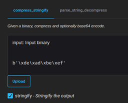
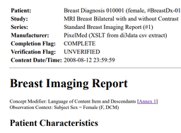

# Packages

Example packages built with itk-wasm can be found below. If you created a
package, please [open a pull
request](https://github.com/InsightSoftwareConsortium/itk-wasm/compare) to add it to the table!

|  Repository |  Description  |  Links |
|-----------------------------|:---------------------------------------------:|:----------------------:|
| [@itk-wasm/compress-stringify][compress-stringify-repo] | [][compress-stringify-demo-js]   *Zstandard compression and decompression and base64 encoding and decoding in WebAssembly.* | ![js][js-logo] ![ts][ts-logo]  [👨‍💻 Demo][compress-stringify-demo-js]  [🕮 Docs][compress-stringify-docs-js]  [📦 Package][compress-stringify-package-js]     ![py][py-logo]  [👨‍💻 Demo][compress-stringify-demo-py]  [🕮 Docs][compress-stringify-docs-py]  [📦 Package][compress-stringify-package-py] |
| [@itk-wasm/dicom][dicom-repo] | [][dicom-demo-js]   *Read files and images related to DICOM file format.* | ![js][js-logo] ![ts][ts-logo]  [👨‍💻 Demo][dicom-demo-js]  [🕮 Docs][dicom-docs-js]  [📦 Package][dicom-package-js]     ![py][py-logo]  [🕮 Docs][dicom-docs-py]  [📦 Package][dicom-package-py] |
| [@itk-wasm/htj2k][htj2k-repo] | [][htj2k-demo-js]   *Wasm-SIMD accelerated decoding and encoding High-throughput JPEG2000 (HTJ2K) images.* | ![js][js-logo] ![ts][ts-logo]  [👨‍💻 Demo][htj2k-demo-js]  [🕮 Docs][htj2k-docs-js]  [📦 Package][htj2k-package-js]     ![py][py-logo]  [🕮 Docs][htj2k-docs-py]  [📦 Package][htj2k-package-py] |

[js-logo]: /_static/javascript-logo.svg
[ts-logo]: /_static/typescript-logo.svg
[py-logo]: /_static/python.svg

[compress-stringify-repo]: https://github.com/InsightSoftwareConsortium/itk-wasm/tree/main/packages/compress-stringify
[compress-stringify-demo-js]: https://itk-compress-stringify-app.on.fleek.co/
[compress-stringify-docs-js]: https://itk-compress-stringify-docs.on.fleek.co/
[compress-stringify-package-js]: https://www.npmjs.com/package/@itk-wasm/compress-stringify
[compress-stringify-demo-py]: https://itk-compress-stringify-py-app.on.fleek.co/
[compress-stringify-docs-py]: https://itk-wasm-compress-stringify-python-docs.on.fleek.co/
[compress-stringify-package-py]: https://pypi.org/project/itkwasm-compress-stringify/

[dicom-repo]: https://github.com/InsightSoftwareConsortium/itk-wasm/tree/main/packages/dicom
[dicom-demo-js]: https://itk-wasm-dicom-app.on.fleek.co/
[dicom-docs-js]: https://itk-wasm-dicom-docs.on.fleek.co/
[dicom-package-js]: https://www.npmjs.com/package/@itk-wasm/dicom
[dicom-docs-py]: https://itk-wasm-dicom-python-docs.on.fleek.co/
[dicom-package-py]: https://pypi.org/project/itkwasm-dicom/

[htj2k-repo]: https://github.com/InsightSoftwareConsortium/ITKIOOpenJPH/tree/main/src/wasm
[htj2k-demo-js]: https://itk-wasm-htj2k-app.on.fleek.co/
[htj2k-docs-js]: https://itk-wasm-htj2k-docs.on.fleek.co/
[htj2k-package-js]: https://www.npmjs.com/package/@itk-wasm/htj2k
[htj2k-docs-py]: https://itk-wasm-htj2k-python-docs.on.fleek.co/
[htj2k-package-py]: https://pypi.org/project/itkwasm-htj2k/
