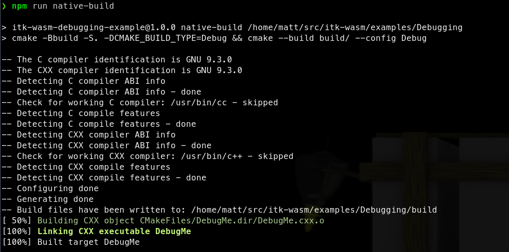
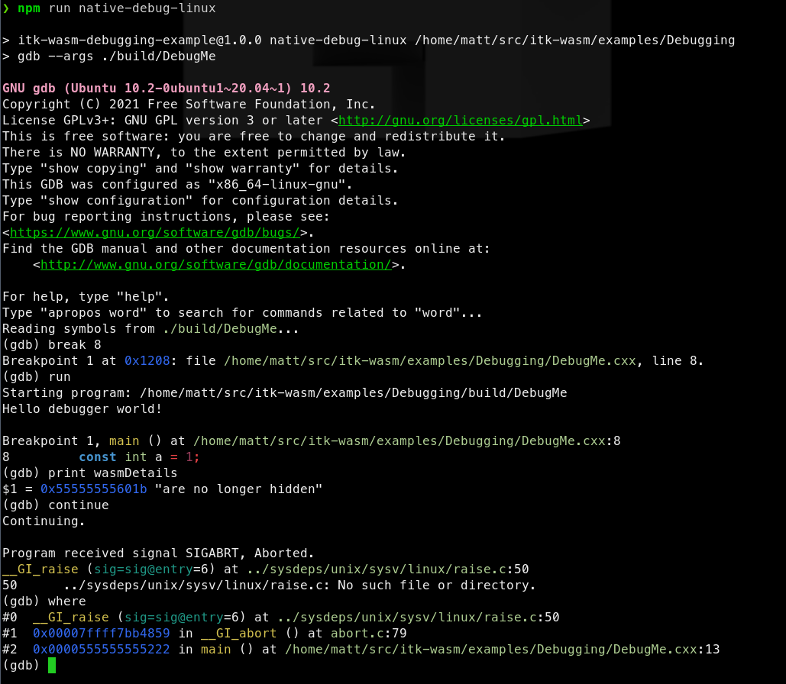
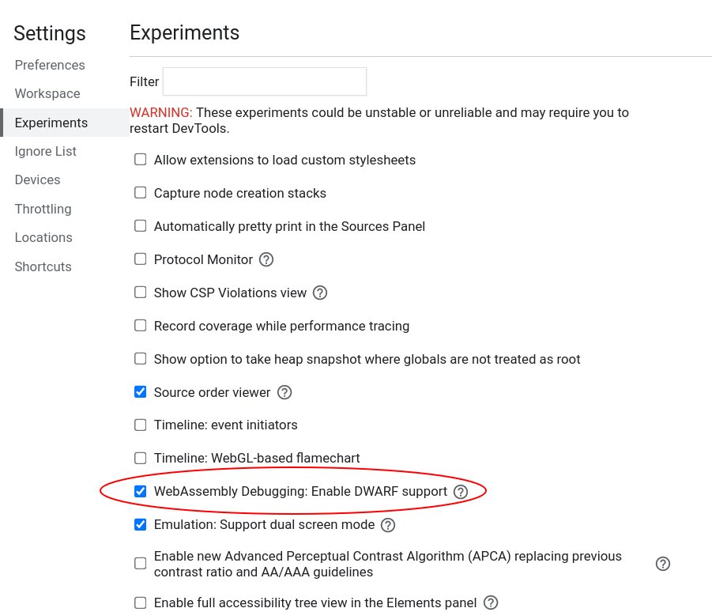
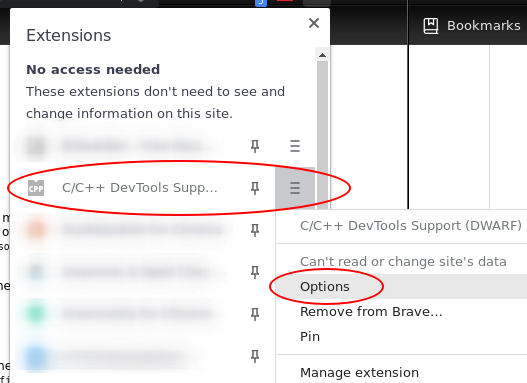
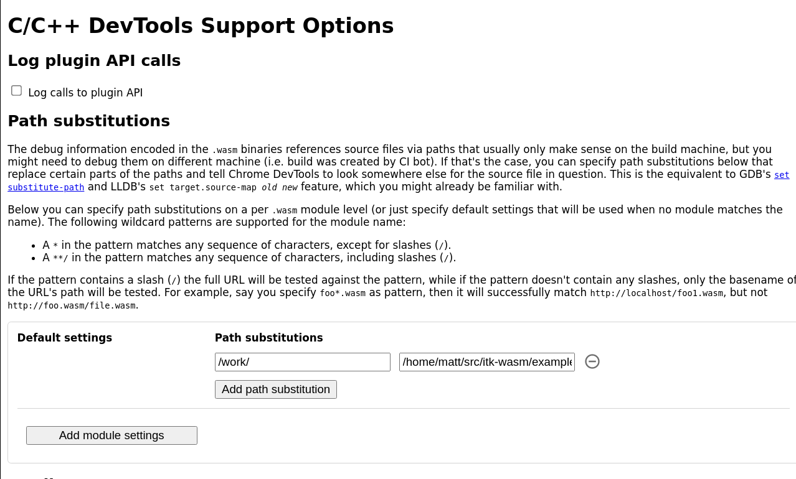

# Debugging WebAssembly

Effective debugging results in effective programming. **itk-wasm** makes effective debugging of WebAssembly possible.

This example walks through the different techniques that can be used with itk-wasm to debug WebAssembly during development.

We will debug the following C++ code:

```cpp
#include <iostream>

int main() {
  std::cout << "Hello debugger world!" << std::endl;

  const char * wasmDetails = "are no longer hidden";

  const int a = 1;
  const int b = 2;
  const auto c = a + b;

  // Simulate a crash.
  abort();
  return 0;
}
```

[The example](https://github.com/InsightSoftwareConsortium/itk-wasm/tree/main/examples/debugging) provides npm scripts as a convenient way to execute debugging commands that you may also invoke directly in a command line shell.

To run these examples, first [install and test](/tutorial/hello_world) Docker and Node/NPM. Then, install the package dependencies and run the example commands.

```
cd itk-wasm/examples/Debugging/
npm install
npm run <name>
```

where `<name>` is the npm script. Available names can be found by calling `npm run` without any arguments.

## Native

The CMake-based itk-wasm build system tooling enables the same C++ build system configuration and code to be reused when building a native system binary or a WebAssembly binary. As a result, native binary debugging tools, such as [GDB](https://sourceware.org/gdb/), [LLDB](https://lldb.llvm.org/), or the [Visual Studio debugger](https://docs.microsoft.com/en-us/visualstudio/debugger/?view=vs-2022).

We can build the project's standard CMake build configuration,

```cmake
cmake_minimum_required(VERSION 3.10)
project(DebuggingWebAssemblyExample)

add_executable(DebugMe DebugMe.cxx)
```

with standard CMake commands,



The native binary can then be debugged in the standard way. For example, with `gdb` on Linux:



## WASI

The most direct way to debug WebAssembly is through the [WebAssembly System Interface (WASI)](https://wasi.dev/). In itk-wasm we can build to WASI with the [WASI SDK](https://github.com/WebAssembly/wasi-sdk) by specifying the `itkwasm/wasi` toolchain image. A backtrace can quickly be obtained with the `itk-wasm` CLI. Or, a fully fledged debugger session can be started with LLDB.

First, build to WASI WebAssembly with debugging symbols available:


Then, the `itk-wasm` CLI can conveniently run the Wasm binary with the included WASI runtime:


We can see that `abort` is called in the `main` function at line 13 in `DebugMe.cxx`.

A full debugging session is also possible after [LLDB](https://lldb.llvm.org/) >= 13 and [Wasmtime](https://wasmtime.dev/) are installed.


## Node.js

When debugging WebAssembly built with the itk-wasm Emscripten toolchain, set the `CMAKE_BUILD_TYPE` to `Debug` as is required to debug native builds.

As with native builds, this builds debugging symbols, the human-readable names of functions, variables, etc., into the binary.  This also adds support for C++ exceptions and retrieving the string name associated with exceptions. Without this itk-wasm instrumentation, a C++ exception will through an error with an opaque integer value. And, Emscripten JavaScript WebAssembly bindings will not be minified, which facilitates debugging.

When built with the default `Release` build type:


the JavaScript support code is minified, and difficult to debug:


However, when built with the `Debug` build type:


a useful backtrace can be obtained:


In order to run a debugger with Node, add the `--inspect-brk` flag when invoking `node`:


This will pause execution on start a debugging remote interface. To connect to the remote interface with a Chromium browser, visit `chrome://inspect` and click the *inspect* link on the corresponding *Remote Target*:


This will open the Chrome Dev Tools debugger:


Other debugger interfaces [are also available](https://nodejs.org/en/docs/inspector), like a CLI debugger or the VSCode debugger.

This is helpful for debugging issues that occur in Emscripten JavaScript interface. The next section describes how to debug issues inside the Emscripten-generated WebAssembly.

## Chromium-based browsers

Recent Chromium-based browsers have support for debugging C++-based WebAssembly in the browser. With a few extra steps described in this section, it is possible to interactively step through and inspect C++-compiled WebAssembly running in the browser.

WebAssembly debugging in DevTools requires a few extra setup steps from a default browser installation.

First, [install the Chrome WebAssembly Debugging extension](https://goo.gle/wasm-debugging-extension).

Next, enable it in DevTools.

  Open DevTools -> Click the *gear (⚙)* icon in the top right corner -> go to the *Experiments* panel -> and tick *WebAssembly Debugging: Enable DWARF support*.



After exitting Settings, you will be prompted to reload DevTools -- reload.

Next, open the options for Chrome WebAssembly Debugging extension:



Since itk-wasm performs builds in a clean Docker environment, the debugging source paths in the Docker environment are different than the paths on the host system. The debugging extension has a path substitution system that can account for these differences. In the Docker image, the directory where `itk-wasm` is invoked is mounted as `/work`. Substitute `/work` with the directory where the `itk-wasm` CLI is invoked. For example, if `itk-wasm` was invoked at `/home/matt/src/itk-wasm/examples/Debugging`, then:



Build the project with itk-wasm and the `Debug` `CMAKE_BUILD_TYPE` to include DWARF debugging information:


Here we load and run the WebAssembly with a simple HTML file and server:

```html
<html>
  <head>
    <script src="https://cdn.jsdelivr.net/npm/itk-wasm@1.0.0-a.11/dist/umd/itk-wasm.js"></script>
  </head>
  <body>
    <p>This is an example to demonstrate browser-based debugging of
    C++-generated WebAssembly. For more information, please see the
    <a target="_blank" href="https://wasm.itk.org/examples/debugging.html">associated
      documentation</a>.</p>

    <script>
      window.addEventListener('load', (event) => {
        const pipeline = new URL('emscripten-build-debug/DebugMe', document.location)
        itk.runPipeline(null, pipeline)
      });
    </script>

  </body>
</html>
```


And we can debug the C++ code in Chrome's DevTools debugger along side the executing JavaScript!


