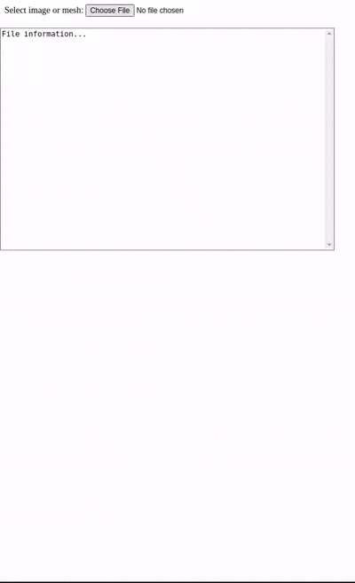
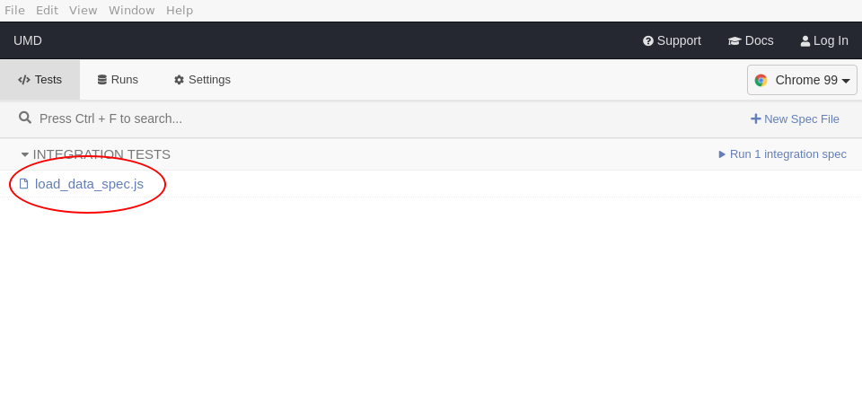
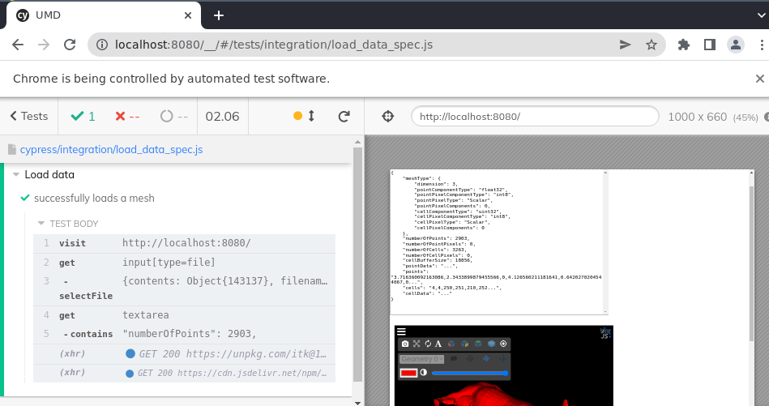
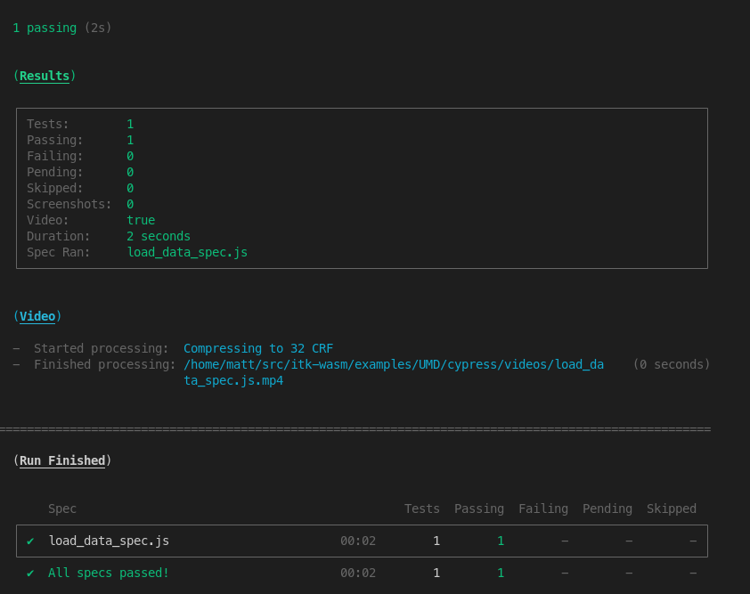

# ITK-Wasm UMD module from a HTML script tag

This example demonstrates how to use *itk-wasm* in a web browser application via its pre-built [UMD](https://github.com/umdjs/umd) module. This is an alternative to bundling the modules with the Webpack application, as shown in the [Webpack example](./webpack). In this example, we re-use the itk-wasm IO modules published on [jsdelivr.com](https://jsdelivr.com). Find the full example in the `itk-wasm/examples/UMD` [directory of the GitHub repository](https://github.com/InsightSoftwareConsortium/ITK-Wasm/tree/main/examples/UMD).

Inside the HTML `head`, load the itk-wasm UMD script:

```html
  <head>
    [...]
    <script src="https://cdn.jsdelivr.net/npm/itk-wasm@1.0.0-b.3/dist/umd/itk-wasm.min.js"></script>
  </head>
```

Inside body JavaScript code, the `itk` object provides [itk-wasm API functions and objects](/typescript/index) as properties.

```javascript
  [...]
  return itk.readFile(null, files[0]).then(function({ image, mesh, webWorker }) {
    webWorker.terminate();
```

These JavaScript itk-wasm components are used by the HTML, CSS, and JavaScript of [the full example](https://github.com/InsightSoftwareConsortium/ITK-Wasm/blob/main/examples/UMD/dist/index.html)

## Simple HTTP server

Optionally, add an npm script that will start a local web server for development.

```
  npm install --save-dev http-server
```

Next, define a `start` command to start a local development web server in the *scripts* section of the `package.json` file,

```javascript
  "scripts": {
    "start": "http-server ./dist/"
  },
```

To start the development web server hosting the `./dist/` directory contents, run

```shell
npm run start
```



## Testing with Cypress

This section described how to configure browser-based testing with the [Cypress](https://www.cypress.io/)

First, install Cypress and the `start-server-and-test` package.

```shell
npm install --save-dev cypress start-server-and-test
```

The `start-server-and-test` tool can start our development server for testing with Cypress.

Create directories to house our tests and test data:

```shell
mkdir -p cypress/integration cypress/fixtures
```

Provide a test dataset:

```shell
cp /path/to/cow.vtk cypress/fixtures/cow.vtk
```

Create our test script at *cypress/integration/load_data_spec.js*. The test files names should end in **_spec.js*.

```
describe('Load data', () => {
  it('successfully loads a mesh', () => {
    cy.visit('http://localhost:8080/')
    cy.fixture('cow.vtk', null).then((cowBuffer) => {
      cy.get('input[type=file]').selectFile({ contents: cowBuffer, fileName: 'cow.vtk' })
      cy.get('textarea').contains('"numberOfPoints": 2903,')
    })
  })
})
```

Then, specify npm scripts to develop and debug the tests and run them in an automated way.

```javascript
  "scripts": {
    "start": "http-server ./dist/"
    "cypress:open": "pnpm exec cypress open",
    "cypress:run": "pnpm exec cypress run",
    "test:debug": "start-server-and-test start http://localhost:8080 cypress:open",
    "test": "start-server-and-test start http://localhost:8080 cypress:run"
  },
```

To develop or debug tests, run

```shell
npm run test:debug
```

This will open Cypress. Select the test to run:




This will load the selected browser to see the test status and web page that is tested.  You can also open the browser's development console.



To run the tests during continuous integration:

```shell
npm run test
```

This will output the tests results in the console:



And produce a video of the result at *cypress/videos/*.


