# Introduction

`itkwasm` enables **universal spatial analysis and visualization** via [WebAssembly (wasm)](https://webassembly.org) {octicon}`telescope`.

`itkwasm` Python packages run on *all modern web browsers and at a system level across all major operating systems and hardware architectures* {octicon}`browser` {octicon}`codespaces`.

All versions of Python 3.7+ are supported {octicon}`globe`.

Additionally, non-wasm packages accelerate performance via GPUs when available {octicon}`rocket`.

In the browser, [Pyodide](https://pyodide.org/)-compatible packages provide client-side web app scripting in Python, including via [PyScript](https://pyscript.net/), and sustainable, scalable Jupyter deployments via [JupyterLite](https://jupyterlite-sphinx.readthedocs.io/) {octicon}`code-square` {octicon}`light-bulb`.

At a system level, Linux, macOS, and Windows operating systems are supported on x86_64 and ARM via [wasmtime-py](https://bytecodealliance.github.io/wasmtime-py/) {octicon}`zap`.

`itkwasm` Python packages are *highly modular*, have *a tiny footprint*, and have *minimal dependencies*; they only depend on `itkwasm`, `numpy`, and `pyodide` or `wasmtime` {octicon}`container`.

## Environment dispatch

There is a primary, pip-installable Python package. In browser environments, this will pull a corresponding [Emscripten](https://emscripten.org)-enabled Python package. For system Python distributions, this will bring in a corresponding [WASI](https://wasi.dev)-enabled Python package. When GPU-accelerated implementations of functions are available in other packages along with required hardware and software, simply pip-installing the accelerator package will cause function calls to invoke accelerated overrides registered with modern [package metadata](https://packaging.python.org/en/latest/guides/creating-and-discovering-plugins/#using-package-metadata).



## Browser and system APIs

While synchronous functions are available in system packages, browser packages provide asynchronous functions for non-blocking, performant execution in the JavaScript runtime event loop. These functions are called with modern Python's [async / await support](https://docs.python.org/3/library/asyncio-task.html).

For example, to install the [itkwasm-compress-stringify](https://pypi.org/project/itkwasm-compress-stringify/) package:

::::{tab-set}

:::{tab-item} System
```shell
pip install itkwasm-compress-stringify
```
:::

:::{tab-item} Browser
In Pyodide, e.g. the [Pyodide REPL](https://pyodide.org/en/stable/console.html) or [JupyterLite](https://jupyterlite.readthedocs.io/en/latest/try/lab),

```python
import micropip
await micropip.install('itkwasm-compress-stringify')
:::

::::


In the browser, call the async `*_async` function with the `await` keyword.

::::{tab-set}

:::{tab-item} System
```python
from itkwasm_compress_stringify import compress_stringify

data = bytes([33,44,55])
compressed = compress_stringify(data)
```
:::

:::{tab-item} Browser
```python
from itkwasm_compress_stringify import compress_stringify_async

data = bytes([33,44,55])
compressed = await compress_stringify_async(data)
```
:::

::::